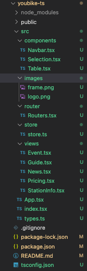
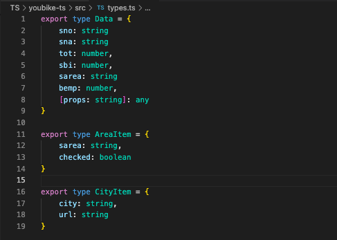
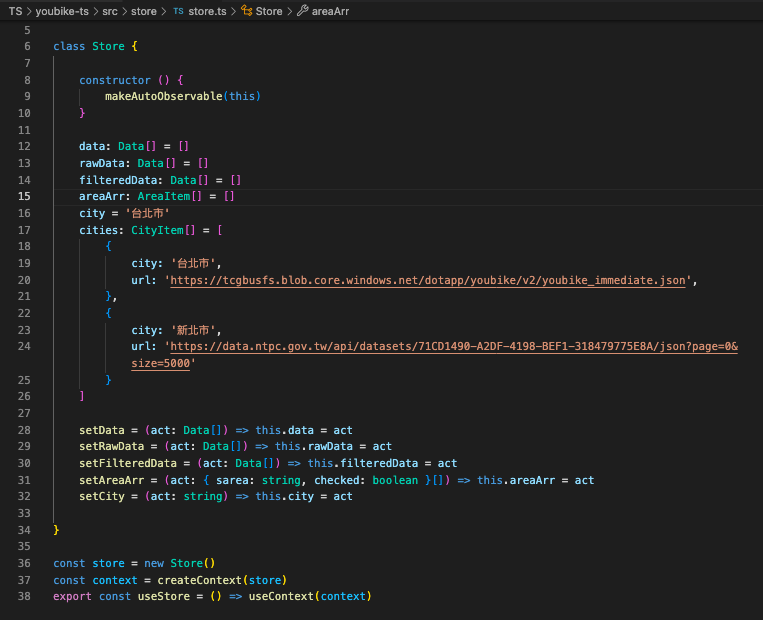
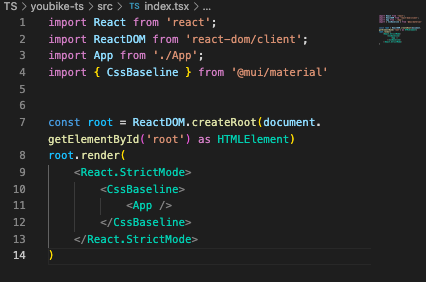
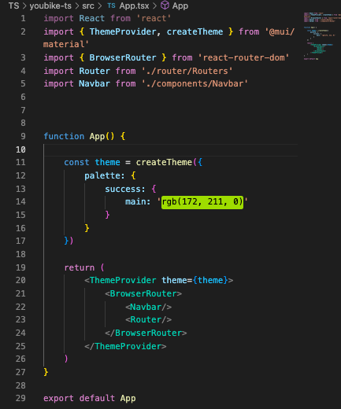
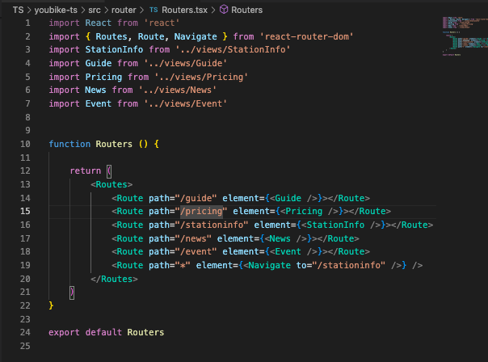
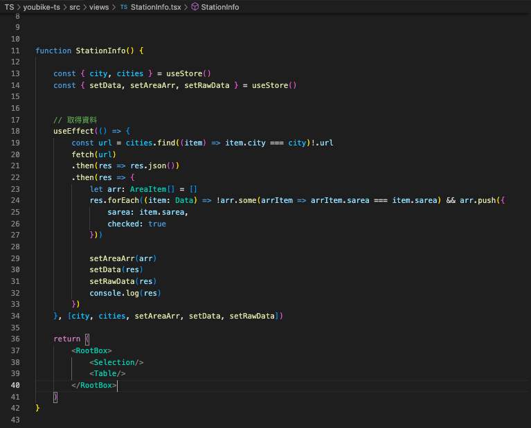
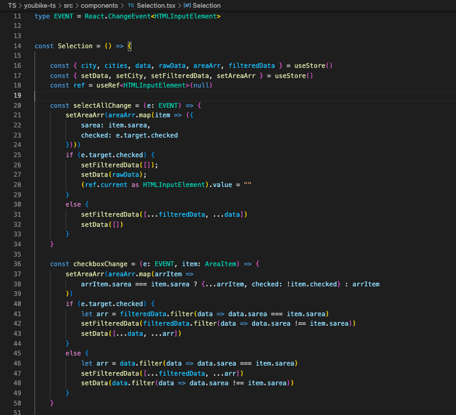
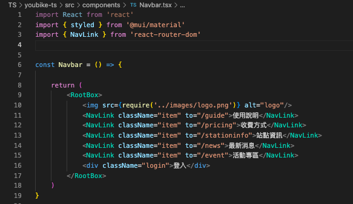
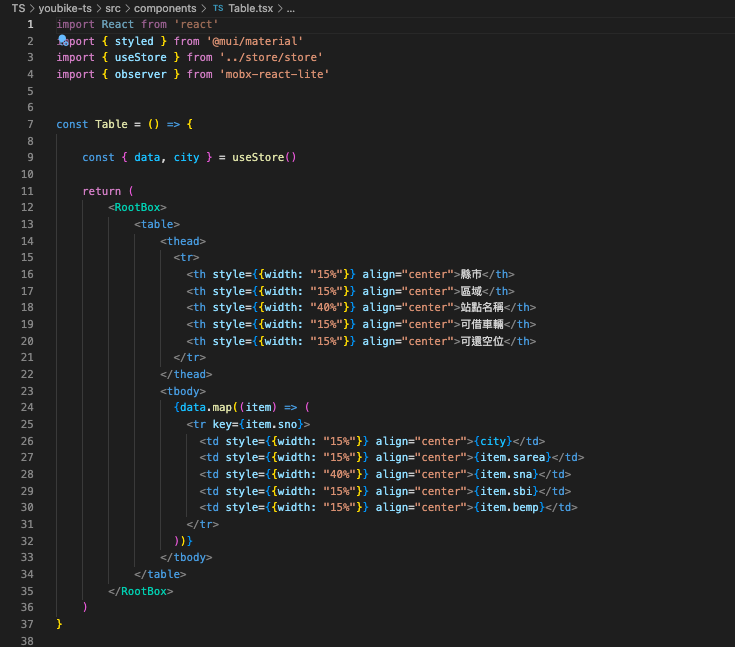

# 項目架構
 

# types定義文件
 

# Store結構
 

# 從index.tsx入口
 

# App.tsx 引入theme, route
 

# Routers.tsx 處理各路由及對應視圖組件  
 

# 默認走views/StationInfo.tsx組件
 

# Selection組件只負責篩選資料, 所有資料操作的處理函數都寫在src/components/Selection.tsx中
 

    
# Navbar組件只負責跳轉路由切換組件
 

# Table組件只負責渲染資料
 
